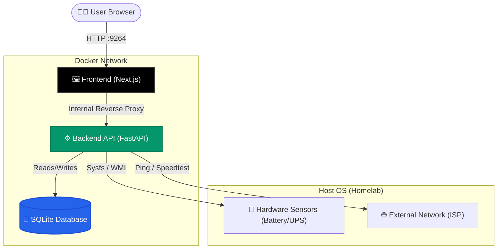

# ⚡ HomePulse

**HomePulse** is a lightweight, real-time telemetry and monitoring dashboard designed specifically for Homelabs. It provides a unified, high-density interface to monitor network stability, internet throughput, and critical hardware power metrics (including UPS/Battery status). 

Built with an industrial, "techy", and zero-radius design philosophy, HomePulse ensures you have all your critical server data at a glance, without unnecessary visual clutter.

---

## 🎯 What is it designed for?

HomePulse was built to solve a specific problem in Homelab environments: **Hardware and Network observability without the overhead of heavy enterprise tools (like Grafana/Prometheus).** 

It is designed to:
- **Monitor Network Health:** Continuously track ping latency and internet speeds to detect ISP outages or throttling.
- **Track Power Resilience:** Monitor battery/UPS state, voltage, and wattage directly from the host OS to track power grid stability and battery drain during outages.
- **Run Anywhere:** Fully containerized with Docker, featuring OS-aware hardware polling that seamlessly adapts to both Linux (Sysfs) and Windows (WMI) host environments.

---

## ✨ Features

- 📊 **Real-time Dashboard:** A dark-mode, high-density React frontend powered by Next.js and Shadcn/UI.
- 🔌 **OS-Aware Power Telemetry:** Automatically reads raw hardware sensors for Voltage (V) and Wattage (W).
  - *Linux:* Directly parses `/sys/class/power_supply/` for microvolts/microwatts.
  - *Windows:* Hooks into the motherboard via WMI to read battery design metrics.
- 🌐 **Network Diagnostics:** Automated speedtests and continuous ping monitoring.
- 💾 **Historical Data:** SQLite-backed storage for reviewing historical outages and latency spikes over 1h, 12h, or 24h periods.
- 🐳 **Docker Native:** Easy deployment via `docker-compose` with internal reverse proxying to avoid CORS and IP configuration headaches.

---

## 🏗️ Architecture

HomePulse follows a decoupled client-server architecture, communicating via RESTful JSON endpoints. 



### Flow of Data:
1. **Background Tasks:** The Python backend runs asynchronous background threads that constantly poll the OS hardware sensors and network interfaces.
2. **Persistence:** The polled data is instantly committed to the local SQLite database.
3. **Frontend Polling:** The Next.js frontend uses `SWR` to fetch data from the API every few seconds.
4. **Internal Proxy:** The Next.js server intercepts `/api/*` requests and securely routes them to the FastAPI container using Docker's internal DNS.

---

## 💻 Tech Stack

### Frontend
- **Framework:** Next.js (React)
- **Styling:** Tailwind CSS + Shadcn/UI (Strict `radius: 0` dark mode aesthetics)
- **Data Fetching:** SWR (Stale-While-Revalidate)
- **Charts:** Recharts

### Backend
- **Framework:** Python FastAPI
- **Database:** SQLite3
- **Hardware Integration:** `psutil`, `wmi` (Windows), `platform`

---

## 🚀 Getting Started

### Prerequisites
- Docker and Docker Compose installed on your host machine.

### Deployment via Docker Compose

1. Clone the repository to your homelab server.
2. Ensure you have the `docker-compose.yml` configured correctly.
3. Start the stack:

```bash
docker compose up --build -d
```

> [!IMPORTANT]
> **For Linux Hosts:** To allow the backend container to read hardware battery/power metrics, you must mount the host's `/sys` directory into the API container as read-only.
> 
> Ensure this volume mapping exists in your `docker-compose.yml`:
> `- /sys:/sys:ro`

### Accessing the Dashboard

Once the containers are running, simply navigate to:
`http://<YOUR_HOMELAB_IP>:9264`

The Next.js internal proxy will automatically route all API requests, so no additional port forwarding or CORS configuration is required.

---

## 🎨 UI/UX Philosophy

The interface was strictly designed with a **"High Density, Zero Clutter"** mindset. 
- **Sharp Edges:** All components use `radius: 0` for a sharp, industrial, and technical look.
- **Dark Mode Only:** Optimized for low-light homelab environments using Tailwind's Zinc/Slate color palettes.
- **Micro-Animations:** Elements feature subtle hover translations and scaling to make the interface feel responsive and alive without being distracting.
- **Tabbed Navigation:** Information is divided into `Overview`, `Network`, and `Power` to prevent cognitive overload while exposing 100% of the underlying API data.

---
*Built for Homelab enthusiasts.*
